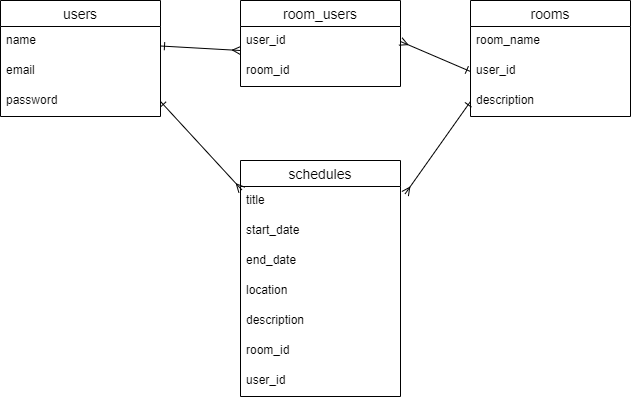
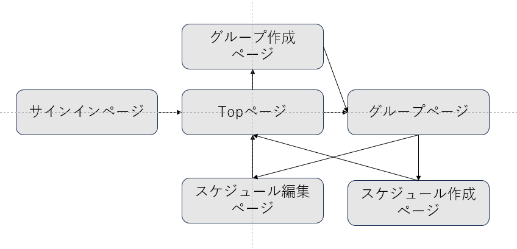

# アプリケーション名
scheduleapp

# アプリケーション概要
スケジュールを自身や周りの人と管理、調整ができる。

# URL
https://scheduleapp-x5rv.onrender.com

# テスト用アカウント
ID : aaa@aaa
PASS : aaa111

# 利用方法

## スケジュール投稿
1.ログインページからユーザー新規登録を行う
2.新規グループ作成ボタンから、グループ内容(グループ名・グループの詳細・グループメンバー)を入力しグループを作成
3.グループページのスケジュール作成ボタンから、スケジュールを作成(タイトル・スケジュールの詳細・開始・終了)を入力

# アプリケーションを作成した背景
家族や知人とのスケジュールを、それぞれメールや別のコミュニケーションツールで管理するのが手間であった。

自身のスケジュール入力、共有したい人とのスケジュールを入力し、また同アプリケーション内で調整もできることで、

一目化してスケジュールの管理ができ日々の予定忘れや日程調整の煩わしさからの開放を期待したアプリケーションを開発することにした。

# 洗い出した要件
https://docs.google.com/spreadsheets/d/1K7lNb-s0AGo5XzOw9K-po7nI5jfcQZ56AlQ0aESoHuo/edit#gid=982722306

# 実装した機能についての画像やGIF及びその説明

## グループ作成
https://gyazo.com/18963080c3c4600ad40b163fe5a87635
サイドバーの新規グループ作成ボタンから、グループ作成ページに遷移する。
https://gyazo.com/248c7b961ace63384d11d0e57d78848f
フォームに必要情報を入力し、ルーム作成ボタンからグループを作成できる。

## スケジュール作成
https://gyazo.com/01f25e4c213be97c40da3193fbfd41ff
グループページのスケジュール作成ボタンから、スケジュール作成ページに遷移する。
https://gyazo.com/7e7ade16b13558b116c322b68e4fa3a2
フォームに必要情報を入力し、スケジュール作成ボタンからスケジュールを投稿できる。

# 実装予定の機能

## スケジュール調整機能
1.グループページから、候補日を最大5日程投稿
2.候補日から参加可否を選択
3.候補日を決定or削除

# テーブル設計

## users テーブル

| Column             | Type    | Options                   |
| ------------------ | ------- | ------------------------- |
| name               | string  | null: false               |
| email              | string  | null: false, unique: true |
| encrypted_password | string  | null: false               |

### Association

- has_many :room_users
- has_many :rooms, through: :room_users
- has_many :schedules

## rooms テーブル

| Column      | Type    | Options     |
| ----------- | ------- | ------------|
| room_name   | string  | null: false |
| description | string  |             |

### Association

- has_many :room_users
- has_many :rooms, through: :room_users
- has_many :schedules

## room_users テーブル

| Column | Type       | Options                        |
| ------ | ---------- | ------------------------------ |
| user   | references | null: false, foreign_key: true |
| room   | references | null: false, foreign_key: true |

### Association

- belongs_to :room
- belongs_to :user

## schedules テーブル

| Column      | Type       | Options                        |
| ----------- | ---------- | ------------------------------ |
| title       | string     | null: false                    |
| body        | string     |                                |
| start_date  | datetime   | null: false                    |
| end_date    | datetime   | null: false                    |
| user        | references | null: false, foreign_key: true |
| room        | references | null: false, foreign_key: true |

### Association

- belongs_to :room
- belongs_to :user

# データベース設計

# 画面遷移図

# 開発環境
- Ruby 2.6.5
- Ruby on Rails 6.0.6.1
- PostgreSQL 14.7
- HTML, CSS (Bootstrap 5.0.2)
- JavaScript (jQuery 3.7.0)
- Render (デプロイ)
- RSpec (テストフレームワーク)
- FactoryBot (テストデータ生成)
- Faker (ダミーデータ生成)

# 工夫したポイント
共有したい人とスケジュールを共有でき、それぞれのグループのカレンダーを確認できる。

トップページでは、自分が参加している全てのグループのスケジュールを表示するようにすることで、自分のスケジュールを把握しやすいようにした。