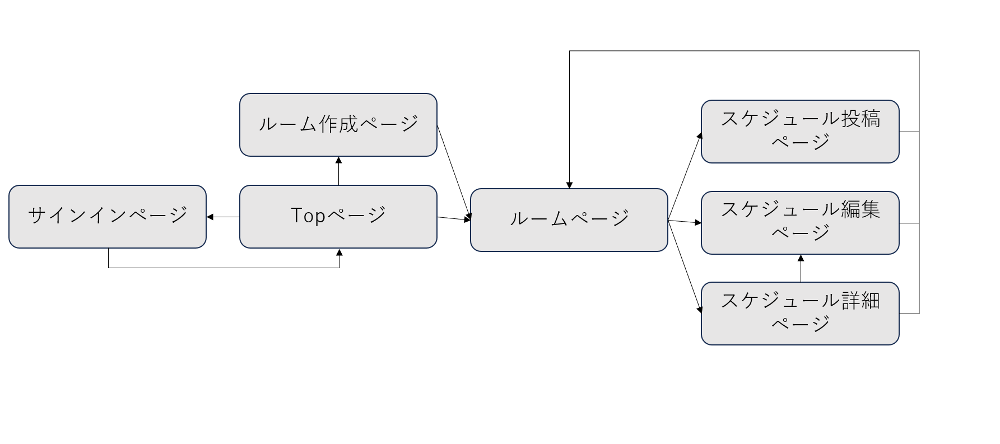

# アプリケーション名
scheduleapp

# アプリケーション概要
スケジュールを自身や周りの人と管理、調整ができる。

# URL

# テスト用アカウント

# 利用方法

## スケジュール投稿
1.トップページ(一覧ページ)のヘッダーからユーザー新規登録を行う
2.新規グループ登録ボタンから、グループ内容(グループ名・メンバー・コメント)を入力し共有グループを作成
3.グループページからスケジュール(タイトル・日時・コメント)を入力

## スケジュール調整
1.グループページから、候補日を最大5日程投稿
2.候補日から参加可否を選択
3.候補日を決定or削除

# アプリケーションを作成した背景
家族や知人とのスケジュールを、それぞれメールや別のコミュニケーションツールで管理するのが手間であった。

自身のスケジュール入力、共有したい人とのスケジュールを入力し、また同アプリケーション内で調整もできることで、

一目化してスケジュールの管理ができ日々の予定忘れや日程調整の煩わしさからの開放を期待したアプリケーションを開発することにした。

# 洗い出した要件

# 実装した機能についての画像やGIF及びその説明

# 実装予定の機能

# データベース設計

# 画面遷移図

# 開発環境

# ローカルでの動作方法

# 工夫したポイント